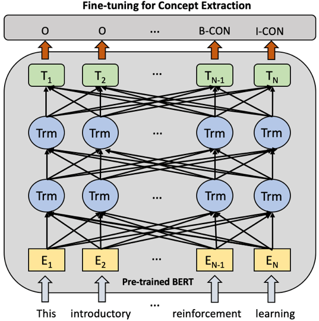
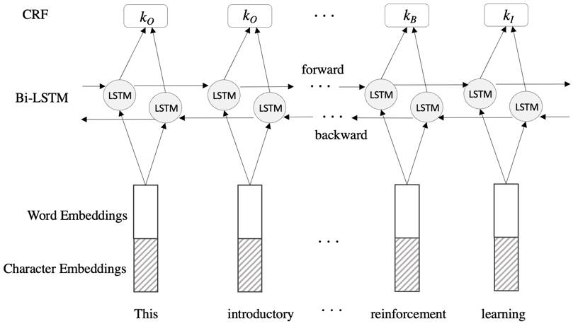

# Concept Extraction for Course Description

This project provides a concept extractor for course descriptions taught in college. The current trained models mainly focus on courses in computer science and information science domains. The extraction models were trained with weak labels from public resources such as IIR dataset, KP20 dataset or Wikipedia.

## Quick Links

- [Model](#model)
- [Installation](#installation)
- [Data](#data)
- [Usage](#usage)
- [Prediction](#prediction)

## Model

BERT architecture adaption for concept extraction 

<p align="center"></p>

Bi-LSTM-CRF architecture adaption for concept extraction 

<p align="center"></p>

## Installation
Install the following required libraries:
- spaCy and NLTK
- scikit-learn
- PyTorch
- transformers

## Data

## Usage
Config file (files/config.json): you can provide paths to the pretrained models you want to use.

We provide several scripts. The usages of these scripts can be accessed by the parameter -h, i.e.,
```
python predict.py -h
python predict_txt.py -h
```

## Prediction
```predict.py``` is provided to extract concepts from a direct text (a sequence of words). A running command example is provided below:
```
python predict.py --input_text "Machine learning is an important subject in Computer Science." --output_file outputs/output.txt
```

```predict_txt.py``` is provided to extract concepts from a text file (for multiple documents). A running command example is provided below:
```
python predict_txt.py --input_file data/sample/input_sample.txt --output_file outputs/output.txt
```
